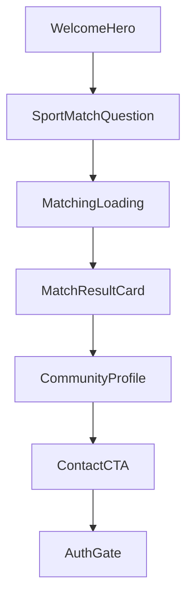

# Component Library — MatchPoint

Living document (Fase 3 · Diseño, added 2026-07-03). Defines the PMV component library — implement these first and avoid creating unnecessary extra UI patterns. Pairs with `docs/design-system.md` (tokens/rules) and `docs/microcopy.md` (copy). Must support: Sport Match™, Results, Community profile, Contact and auth gate.

## Component principles

Mobile-first, reusable, visually calm and premium, support Match™ microcopy, reduce friction, accessible.

## Core flow



## WelcomeHero

Introduces Match™ and starts the flow.

```ts
type WelcomeHeroProps = {
  title: string
  subtitle: string
  ctaLabel: string
  onStart: () => void
}
```

Content: title "Hola, soy Match™.", subtitle "Te ayudo a encontrar una comunidad deportiva que encaje contigo. Tomará menos de un minuto.", CTA "Comenzar Sport Match™". Rules: only one primary CTA, no login, no secondary distractions.

## SportMatchQuestion

Renders one Sport Match™ question.

```ts
type SportMatchQuestionProps = {
  step: number
  totalSteps: number
  title: string
  helperText?: string
  options: SportMatchOption[]
  selectedValue: string | string[] | null
  multiple?: boolean
  onSelect: (value: string) => void
  onContinue: () => void
  onBack?: () => void
}
```

Rules: one question per screen; large selectable options; continue button disabled until valid answer; back allowed after first question.

## SportMatchProgress

Shows progress through the questionnaire.

```ts
type SportMatchProgressProps = {
  currentStep: number
  totalSteps: number
}
```

Rules: subtle, should not create pressure, communicates progress clearly.

## SelectableOption

Reusable option button for Sport Match™.

```ts
type SelectableOptionProps = {
  label: string
  value: string
  icon?: ReactNode
  selected: boolean
  onClick: () => void
}
```

States: default, selected, hover, disabled.

## MatchingLoading

Branded transition while calculating matches. Content: "Estoy buscando comunidades que realmente encajen contigo..." Visuals: animated sequence — sport, location, calendar, people, sparkle. Rules: duration around 3 seconds; don't use only a generic spinner.

## MatchResultCard

Shows a recommended community.

```ts
type MatchResultCardProps = {
  organizationId: string
  name: string
  slug: string
  imageUrl?: string
  sport: string
  district: string
  matchLabel: string
  reasons: string[]
  tags?: string[]
  onViewCommunity: () => void
}
```

Required content: name, match label, sport, district, reasons, CTA. Rules: show 2-3 reasons on card; do not show raw score as primary UI; CTA label "Ver comunidad".

Below the result list, a plain secondary button — "Cambiar mis respuestas" — is always visible regardless of match quality (`006-no-empty-results` FR-008). Not a new reusable component (a single-use link-button on the Results screen), just noted here so it's not undocumented.

## MatchReasonList

Shows why a recommendation fits.

```ts
type MatchReasonListProps = {
  reasons: string[]
  maxVisible?: number
}
```

Example: "Entrena cerca de ti.", "Tiene horarios nocturnos.", "Acepta principiantes."

## MatchLabel

Displays match quality.

```ts
type MatchLabelProps = {
  label: 'excellent_match' | 'very_good_match' | 'good_match' | 'possible_match' | 'weak_match'
}

const matchLabelMap = {
  excellent_match: 'Excelente Match',
  very_good_match: 'Muy buen Match',
  good_match: 'Buen Match',
  possible_match: 'Match posible',
  weak_match: 'Baja compatibilidad'
}
```

`label` values match the `match_label` enum in `docs/database-schema.md` exactly.

## CommunityHero

Top section of the organization profile.

```ts
type CommunityHeroProps = {
  name: string
  coverImageUrl?: string
  logoUrl?: string
  organizationType: string
  sports: string[]
  district: string
  matchLabel?: string
  isVerified?: boolean
  isClaimed?: boolean
}
```

Rules: strong visual identity; show trust signals if available; keep contact CTA accessible.

## CommunityADN

Displays ADN Deportivo™.

```ts
type CommunityADNProps = {
  beginnerFriendly?: number
  competitiveness?: number
  socialAtmosphere?: number
  trainingIntensity?: number
  performanceFocus?: number
  inclusiveness?: number
}
```

Display with readable labels: Ideal para principiantes, Ambiente social, Competitividad, Intensidad, Alto rendimiento, Inclusividad. Rules: do not show missing values; avoid making it feel like a judgment; present as personality, not ranking.

## ScheduleCard

Shows training schedules.

```ts
type ScheduleCardProps = {
  dayOfWeek: number
  startTime: string
  endTime?: string
  venueName?: string
  district?: string
  levelMin?: string
  levelMax?: string
}
```

## VenueCard

Shows where the community trains.

```ts
type VenueCardProps = {
  name: string
  district: string
  address?: string
  reference?: string
  hasParking?: boolean
  hasShowers?: boolean
  hasLockers?: boolean
}
```

## CoachCard

Shows coach information. Note: `docs/data-model.md` open question 2 (Coach modeling) is still unresolved — this component's props assume a coach record exists regardless of whether it's backed by a standalone `coaches` table or embedded/organization-type data.

```ts
type CoachCardProps = {
  name: string
  bio?: string
  photoUrl?: string
  certifications?: string[]
  instagramUrl?: string
  isVerified?: boolean
}
```

## ContactCTA

Primary conversion component.

```ts
type ContactCTAProps = {
  organizationId: string
  hasWhatsapp: boolean
  hasInstagram: boolean
  hasBooking: boolean
  onContact: (type: 'whatsapp' | 'instagram' | 'booking') => void
}
```

Rules: sticky on mobile profile; only show available contact methods; triggers auth gate if user is not logged in; creates a Lead before external redirect (per `docs/business-rules.md` BR-003 and `docs/api-contracts.md`'s `POST /api/leads`).

## AuthGate

Prompts login only before contact.

```ts
type AuthGateProps = {
  pendingContactType: string
  organizationName: string
  onGoogleLogin: () => void
  onAppleLogin: () => void
}
```

Copy: title "Continúa para contactar.", body "Así podremos guardar tu Match y ayudarte a medir si encontraste una comunidad para entrenar.", buttons "Continuar con Google" / "Continuar con Apple". Rules: no email/password, no full registration, no extra profile fields.

## EmptyMatchState

Narrowed (`006-no-empty-results`): recovers from the one remaining true empty state — zero organizations in the catalog offer the requested sport. "Weak-but-real matches" is no longer a state this component needs to handle; those are always shown as normal results now (with a persistent "change answers" action on the results screen itself, not this component — see `MatchResultCard`/Results flow). `onExpandDistrict`/`onChangeSchedule` are dropped: neither helps when the gap is sport coverage, not answer shape.

```ts
type EmptyMatchStateProps = {
  onChooseAnotherSport: () => void
}
```

Copy: "Todavía no tenemos comunidades de este deporte." / "No es algo que puedas resolver cambiando tus otras respuestas — elige otro deporte y sigo buscando." Action label: "Elegir otro deporte."

Note: `Results.tsx`'s actual implementation inlines this state directly rather than using a shared component — that drift predates `006-no-empty-results` and isn't this fix's job to resolve; the copy/props above describe the intended shape either way.

## ErrorMessage

Shows calm, human errors.

```ts
type ErrorMessageProps = {
  title: string
  description?: string
  actionLabel?: string
  onAction?: () => void
}
```

## Component priority

**P0**: WelcomeHero, SportMatchQuestion, SportMatchProgress, SelectableOption, MatchingLoading, MatchResultCard, MatchReasonList, CommunityHero, ContactCTA, AuthGate, ErrorMessage.

**P1**: CommunityADN, ScheduleCard, VenueCard, CoachCard, EmptyMatchState.

**P2**: EventCard, ReviewCard, SavedMatchButton, OrganizationClaimBanner.

## Final component rule

Do not create components that support non-PMV features before the core flow works. Every PMV component should help the user move from Sport Match™ → Recommendation → Trust → Contact.
