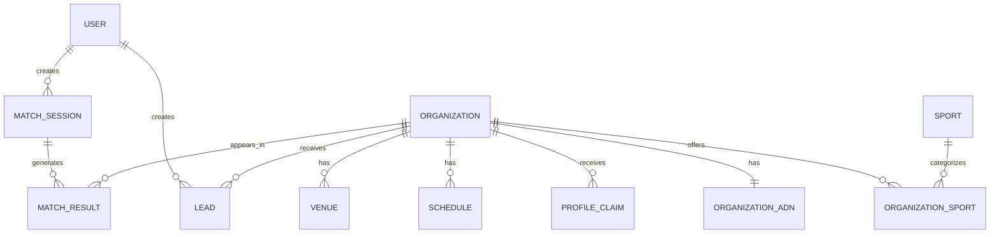

# Data Model — MatchPoint

Living document. Reconciled 2026-07-03 (Fase 2 · Ingeniería) against the imported Engineering Pack (`docs/database-schema.md`, `docs/business-rules.md`, `docs/api-contracts.md`). Supersedes the prior conceptual draft. Referenced by the `data-model-review` skill and the `backend-architect` agent.

**Deliberate divergence from the imported pack:** the source Database Schema gives `Lead` a `status` enum (`initiated → opened → contacted → booked → attended → converted → invalid`) and a mutable `external_url_opened` flag. This was intentionally **not adopted** — MatchPoint already decided (2026-07-03, with explicit product-owner sign-off) that `Lead` is a single immutable event, not a workflow, specifically to avoid reintroducing the old `Booking` state machine. `Lead` below has no `status`/`external_url_opened` field. If "was the external link opened" needs tracking later, model it as an analytics event or an append-only `LeadEvent` log, not a mutation on `Lead` itself.

The most important modeling decision carried over from the prior reconciliation: do not model only "teams" — model `Organization`, since a team, gym, club, training center, coach, federation, academy, or event organizer can all exist on the platform. The model must support Sport Match™, ADN Deportivo™, profile claiming, and the North Star: contacts generated between users and sports organizations.

## Modeling principles

1. MatchPoint is a matching platform, not a directory.
2. Data must improve Sport Match™ quality.
3. Users can complete Sport Match™ before login.
4. Login happens only before contact.
5. A Lead is created every time a user takes a direct contact action — and stays immutable once created (see divergence note above).
6. Organizations can be preloaded, claimed, verified, rejected, suspended, or archived.
7. Missing data should reduce match confidence, not break the product.
8. Use flexible entities that can support future sports beyond running.

## Core entity map

`Event` and `Coach` are defined below but intentionally excluded from this diagram and from `docs/database-schema.md`'s migration order — both are **defined-but-deferred** (documented shape, not built in PMV; see their sections for why).

## User

Represents a person looking for where to train.

| Field | Type | Required | Notes |
|---|---|---:|---|
| id | uuid | yes | Primary key |
| auth_provider | text | yes | google/apple |
| auth_provider_id | text | yes | Provider ID |
| name | text | no | From auth provider |
| email | text | no | From auth provider |
| avatar_url | text | no | Optional |
| phone | text | no | Future |
| home_district_id | uuid | no | Optional |
| created_at | timestamp | yes | System |
| updated_at | timestamp | yes | System |

Rules: User is created only after Google or Apple login (Product Principle 1 — no persisted account before that). Sport Match™ can be completed anonymously; anonymous match sessions can be linked to the user after login.

## Sport

Represents a sport or training category.

Initial: running, trail running, cycling, swimming, triathlon, training center. Future: Hyrox, CrossFit, pádel, yoga, pilates, martial arts, functional training.

## District

Represents Lima Metropolitana and Callao districts in the PMV.

Rules: PMV scope is Lima Metropolitana and Callao; future versions can include all Peru. District-level matching is enough for V1 (see `docs/matching-engine.md`) — exact lat/lng radius search can come later.

## Organization

The main supply-side entity.

Types: `running_team, trail_team, cycling_club, swimming_academy, triathlon_club, training_center, gym, coach_independent, federation, event_organizer, sports_community, academy, other`.

| Field | Type | Required | Notes |
|---|---|---:|---|
| id | uuid | yes | Primary key |
| name | text | yes | Public name |
| slug | text | yes | Unique URL slug |
| organization_type | enum | yes | Type |
| description | text | no | Long profile |
| short_description | text | no | Card copy |
| logo_url | text | no | Logo |
| cover_image_url | text | no | Hero image |
| instagram_url | text | no | Contact/social |
| whatsapp_number | text | no | Contact |
| website_url | text | no | Optional |
| booking_url | text | no | Optional |
| profile_status | enum | yes | preloaded/claimed/verified/rejected/suspended/archived |
| completeness_score | integer | yes | 0-100 |
| is_active | boolean | yes | Visibility |
| created_at | timestamp | yes | System |
| updated_at | timestamp | yes | System |

Rules: preloaded organizations can appear in recommendations if required fields exist. Suspended and archived organizations must never appear publicly (BR-008). Organizations without a contact method should not show a contact CTA (BR-009).

## OrganizationSport

Many-to-many join between Organizations and Sports, with an `is_primary` flag. An organization can offer multiple sports; one is marked primary.

Note: this is a normalized table in `docs/database-schema.md` rather than an embedded array — a physical-schema refinement, not a product decision change. Organization sports still carry no independent claim status or lead attribution of their own.

## Venue

A physical location, branch, or meeting point (gym branch, park meeting point, pool, trail meeting point, cycling start point) belonging to one Organization.

| Field | Type | Required |
|---|---|---:|
| id | uuid | yes |
| organization_id | uuid | yes |
| name | text | yes |
| district_id | uuid | yes |
| address | text | no |
| reference | text | no |
| latitude | numeric | no |
| longitude | numeric | no |
| has_parking | boolean | no |
| has_showers | boolean | no |
| has_lockers | boolean | no |
| is_primary | boolean | yes |

Like Schedule below, Venue is a normalized table for query efficiency — it remains a descriptive attribute of its Organization, not an independently matchable/contactable/claimable entity (that role stays exclusively with Organization, per the prior reconciliation that Community does not exist as a separate entity).

## Schedule

Recurring training sessions.

| Field | Type | Required |
|---|---|---:|
| id | uuid | yes |
| organization_id | uuid | yes |
| venue_id | uuid | no |
| sport_id | uuid | yes |
| day_of_week | integer | yes |
| start_time | time | yes |
| end_time | time | no |
| session_name | text | no |
| level_min | enum | no |
| level_max | enum | no |
| intensity | enum | no |
| capacity | integer | no |
| is_active | boolean | yes |

## Coach

Represents an individual trainer or coach.

| Field | Type | Required |
|---|---|---:|
| id | uuid | yes |
| name | text | yes |
| bio | text | no |
| photo_url | text | no |
| instagram_url | text | no |
| certifications | text[] | no |
| years_experience | integer | no |
| is_verified | boolean | yes |

**Defined but not implemented in PMV** — same treatment as Event below. The imported conceptual model describes Coach as its own entity with an N—N join to Organization, but `docs/database-schema.md`'s 16-step migration order never creates a `coaches` or `organization_coaches` table. Until that gap is resolved, treat an independent, separately-contactable coach as an `Organization` with `organization_type = coach_independent`; treat a coach named inside another org's profile (e.g. "Coach: Juan Pérez") as free-text/embedded display data on that Organization, not a join to this table. Open question #2 below tracks this.

## OrganizationADN

Represents ADN Deportivo™ — one of the most important entities, since it powers MatchPoint's differentiation.

| Field | Type | Scale |
|---|---|---|
| beginner_friendly | integer | 1-5 |
| competitiveness | integer | 1-5 |
| social_atmosphere | integer | 1-5 |
| training_intensity_score | integer | 1-5 |
| performance_focus | integer | 1-5 |
| inclusiveness | integer | 1-5 |
| family_friendly | integer | 1-5 |
| group_size | enum | small/medium/large |
| coach_involvement | integer | 1-5 |
| event_frequency | integer | 1-5 |
| culture_tags | text[] | optional |

Rules: ADN Deportivo™ drives environment fit; missing ADN should reduce match confidence, not exclude the organization; in PMV, ADN can be manually curated.

## Event

One-time sports activities (fondo, clase gratuita, carrera, clínica, rodada, entrenamiento especial, competencia, charla, lanzamiento), organized by an Organization (typically `event_organizer`).

**Defined but not implemented in PMV** — no event discovery flow, no `/events` route, per `docs/product-brief.md`'s V2 roadmap and `docs/ux-flows.md`'s navigation rules. The model should support it for V2 (BR-026).

## MatchSession

Represents one completed Sport Match™ questionnaire flow. (Renamed from the prior reconciliation's `SportMatchSession` to match the naming used consistently across `docs/database-schema.md`, `docs/api-contracts.md`, and `docs/business-rules.md`.)

| Field | Type | Required |
|---|---|---:|
| id | uuid | yes |
| user_id | uuid | no |
| anonymous_id | text | no |
| goal | enum | yes |
| sport_id | uuid | yes |
| district_id | uuid | yes |
| available_days | integer[] | yes |
| preferred_times | text[] | yes |
| level | enum | yes |
| budget_range | enum | yes |
| environment | enum | yes |
| completed_at | timestamp | yes |

Rules: anonymous session is allowed (`user_id` null, `anonymous_id` set); if the user logs in later, the session can be linked to the user (`user_id` populated). This resolves the prior open question "is Match a persisted, explainable ranking?" — yes, persisted, and the ranked results are persisted too (see MatchResult).

## MatchResult

One organization recommended in a MatchSession. **This resolves the prior open question** on whether ranked results are persisted — yes, one row per organization per session.

| Field | Type | Required |
|---|---|---:|
| id | uuid | yes |
| match_session_id | uuid | yes |
| organization_id | uuid | yes |
| score | integer | yes |
| label | enum | yes |
| rank | integer | yes |
| reasons | jsonb | yes |

## Lead

Represents the North Star event — the PMV's sole conversion/contact record. Created when a user performs a contact action. **Single immutable event, no state machine** (see divergence note at the top of this document).

| Field | Type | Required |
|---|---|---:|
| id | uuid | yes |
| user_id | uuid | yes |
| organization_id | uuid | yes |
| match_session_id | uuid | no |
| match_result_id | uuid | no |
| contact_type | enum | yes |
| source | enum | yes |
| sport_id | uuid | no |
| goal | text | no |
| district_id | uuid | no |
| result_rank | integer | no |
| created_at | timestamp | yes |

Rules: every contact action (WhatsApp, Instagram, booking, call, form) must create a Lead before opening the external destination (BR-003); a user may create multiple leads from one match session, one per contact (BR-020); a future rule may de-duplicate identical leads (same user + organization + contact type) within a short window (BR-021), but that's a write-time guard, not a status field.

## ProfileClaim

An organization's request to claim a preloaded profile. Statuses: `pending, approved, rejected, needs_more_info`. See `docs/ux-flows.md` Flow 8 (V1.1, not PMV) for the surrounding UX.

## Minimum launch dataset

An organization should appear in Sport Match™ only if it has: name, sport, district or venue, contact method, basic schedule or availability note, level, environment tag, short description.

## Open questions for /speckit-clarify

1. **Organization self-service auth** — still open; profiles are preloaded then claimed (`docs/ux-flows.md` Flow 8, V1.1 not PMV); the claim-flow auth model is unspecified.
2. **Coach modeling** — narrowed: the imported pack's conceptual `Coach` entity + N—N join is not backed by any table in `docs/database-schema.md`. Resolve whether to (a) build the `coaches`/`organization_coaches` tables as originally conceived, (b) keep coaches as free-text fields on Organization, or (c) model every independently-contactable coach as `organization_type = coach_independent` and drop the separate entity — before building any coach-specific profile UI.
3. **Community-as-sub-entity for V1.1+** — confirmed dead for PMV; still open whether a single legal Organization will ever need multiple distinct sub-program profiles later.
4. ~~Are ranked results persisted?~~ **Resolved**: yes, via `MatchResult` (one row per organization per session).
5. **Trial class / attendance definition** — still open, out of scope until V2; the imported Lead `status` enum's `booked`/`attended` values were **not adopted** (see divergence note) precisely because attendance tracking is V2/Booking scope, not a PMV Lead concern.
6. **Lead `source` enum values** — now resolved by `docs/database-schema.md`'s `lead_source` enum: `result_card, organization_profile, event_profile, direct_search, admin_test`.
7. ~~Should the user be able to contact more than one community at once?~~ **Resolved** by BR-020: yes, a user may create multiple leads from one match session.

## Final data rule

MatchPoint's defensibility depends on structured sports data. The database should improve match quality, not just display profiles.
