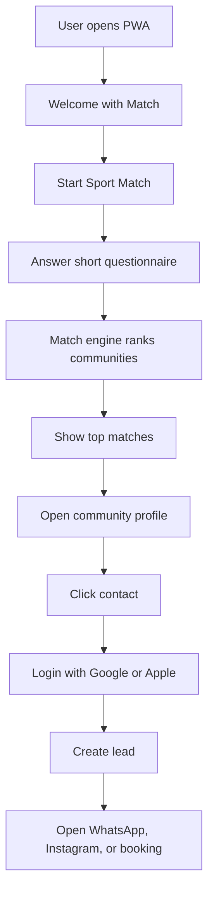

# Product Brief — MatchPoint

Living document — input for `/speckit-specify`. Read alongside `docs/vision.md` (why), `docs/product-principles.md` (how to decide), `docs/matching-engine.md` (Sport Match™ logic), and `docs/ux-flows.md` (screens/navigation).

When implementing the product, prioritize the PMV flow: Sport Match™ → Results → Community profile → Contact. Do not build social feed, payments, chat, likes, comments, or advanced marketplace features in V1 unless explicitly requested.

## 1. Executive summary

MatchPoint is a PWA that helps people in Lima Metropolitana and Callao discover the sports community that best fits their goals, location, schedule, level, and preferred environment.

The first version focuses on amateur sports discovery across running, trail, cycling, swimming, triathlon, and training centers.

The product solves a clear problem: sports communities, teams, coaches, clubs, gyms, training centers, and activities are fragmented across Instagram, TikTok, Google, WhatsApp groups, personal recommendations, and informal networks. For users, this makes discovery slow, confusing, and unreliable. For organizations, this creates dependence on social media and word-of-mouth.

MatchPoint creates a structured discovery experience powered by Sport Match™, a guided matching flow that recommends communities based on user goals and organizational fit. The PMV will validate whether users want a personalized recommendation experience and whether organizations value the contacts generated by the platform.

## 2. Mission

> Make finding the ideal sports community as easy as ordering a taxi or reserving a restaurant.

## 3. Vision

Become the platform where anyone in Peru can discover where to train, who to train with, and what sports activities are happening near them. Ten-year ambition: "Todas las comunidades deportivas del Perú están aquí."

## 4. Problem statement

More people want to practice sports, improve their health, prepare for races, join communities, and become more consistent. However, finding where to train remains fragmented and inefficient — a person currently has to search through Instagram accounts, TikTok videos, Google Maps, WhatsApp groups, Facebook groups, friend recommendations, event pages, and coach posts.

This creates several problems: information is incomplete, prices are often unclear, schedules are hard to compare, locations are not centralized, beginner friendliness is unknown, team culture is hard to understand, the user does not know which option is right for their level, and many great communities are invisible if they do not post often.

The problem is strongest for the user. The initial product must serve the user first. Organizations are part of the supply side, but the PMV should obsess over helping the user discover and contact the right community quickly.

## 5. Target geography

Initial scope: Lima Metropolitana, Callao. Future expansion: major Peruvian cities, full Peru, Latin America if the model proves scalable.

## 6. Initial sports scope

PMV sports: running, trail running, cycling, swimming, triathlon, training centers.

Future sports: Hyrox, CrossFit, pádel, yoga, pilates, martial arts, climbing, rowing, functional training, team sports, official federations, professional events.

## 7. Primary user

The primary PMV user is the amateur athlete or aspiring athlete looking for a place, community, or activity to train. The product should not start by optimizing for the organization dashboard — it should start by optimizing for the user journey: "I want to train, but I do not know where to start or which community fits me."

## 8. Supply-side users

Organizations that can have a profile: running teams, trail teams, cycling clubs, swimming academies, triathlon clubs, training centers, gyms, coaches, federations, event organizers, sports communities, official competitions, sports services.

For the PMV, profiles should be preloaded by MatchPoint and later claimed by organizations. Do not depend on organizations creating all profiles from zero.

## 9. PMV strategy

The PMV is not a full marketplace — it is a learning machine. It exists to validate: (1) whether users complete Sport Match™, (2) whether users trust recommendations, (3) whether users contact organizations, (4) whether organizations receive valuable leads, (5) whether the platform can create a repeatable discovery flow.

## 10. PMV core flow

Full screen-by-screen detail lives in `docs/ux-flows.md`.

## 11. PMV functional scope

Build only these four primary capabilities first:

1. **Sport Match™** — a short, guided flow that collects user preferences and creates recommendations.
2. **Results** — a ranked list of recommended sports communities with short explanations.
3. **Community profile** — a structured profile that lets the user evaluate a community.
4. **Contact** — a gated contact action that creates a lead and then opens WhatsApp, Instagram, or booking.

## 12. PMV non-scope

Do not build in V1: social feed, user-uploaded photos, likes, comments, chat, payments, in-app subscriptions, advanced organization dashboards, wearables integration, public user profiles, gamification, reviews at scale, native mobile apps, complex admin workflows, real-time messaging, multi-country support.

## 13. Authentication strategy

The user should not log in before receiving value. Login appears only when the user attempts to contact a community.

Allowed auth methods: Continue with Google, Continue with Apple. No password signup, no email form, no long registration.

Rationale: the user is more likely to log in after seeing a relevant match and deciding to contact a community.

## 14. North Star Metric

> Contacts generated between users and sports organizations.

Valid contact events: WhatsApp click, Instagram click, booking click, call click, contact form submission, trial class request.

This metric is more useful than downloads, registrations, or profile views because it represents real value creation.

## 15. Success metrics

**Activation** — % of users who start/complete Sport Match™, time to complete Sport Match™, % of users who view results.

**Match quality** — % of users who open at least one profile, % who contact at least one organization, click-through rate result card → profile, click-through rate profile → contact, user feedback "Was this a good match?".

**Marketplace value** — number of contacts per organization, number of organizations receiving at least one contact, contact-to-response rate if measurable, claimed profiles.

**Retention** — repeat Sport Match™ sessions, returning users, users who contact more than one organization.

## 16. Core personas

### Persona 1: The Explorer

Wants to start a sport but does not know where to begin. Job to be done: "When I want to start a sport, I want to find a welcoming community quickly so I do not waste time searching across social media." Needs: beginner-friendly options, clear schedules, safe first step, trial class, social proof. Fears: feeling out of place, joining a group too advanced, not knowing prices, not understanding how to start.

### Persona 2: The Evolver

Already trains but needs a better fit. Job to be done: "When my current sports routine no longer fits my life, I want to find a new community that better matches my schedule, location, and goals." Needs: better schedule, better location, different level, new community, better coaching.

### Persona 3: The Competitor

Wants performance improvement. Job to be done: "When I want to improve my performance, I need to find the right coach, team, and services to reach my goal." Needs: certified coach, structured plan, advanced groups, performance culture, nutrition/strength/physiotherapy.

## 17. Product pillars

1. **Goal-first discovery** — the product starts with the user's goal, not with a search bar.
2. **Guided matching** — MatchPoint recommends instead of forcing users to manually compare many options.
3. **Trust through explanation** — every recommendation must explain why it is relevant.
4. **Low friction contact** — the user must be able to contact a community quickly.
5. **Structured sports data** — the platform must gradually build a proprietary database of sports communities.

## 18. Wizard of Oz PMV

Sport Match™ should feel intelligent in V1, but it does not need a complex AI model. V1 can use rule-based filtering, weighted scoring, manually curated organization data, GPT-generated explanation text, admin review of initial organizations, manual verification of profiles. The goal is to validate behavior before building advanced technology. Full scoring model in `docs/matching-engine.md`.

## 19. Organization profile strategy

Profiles should be preloaded by MatchPoint; organizations can later claim their profiles.

Profile statuses: preloaded, claimed, verified, incomplete, suspended.

Rationale: a marketplace cannot launch empty. Preloading creates immediate user value and allows MatchPoint to validate demand before waiting for organizations to onboard themselves.

## 20. Monetization strategy

Do not monetize in the PMV. First validate user demand, contact generation, organization value, data quality, repeat behavior.

Future monetization options: freemium organization profiles (free basic visibility; paid featured placement, advanced analytics, more photos, event promotion, lead insights, booking tools), lead-based monetization, event promotion, brand partnerships, marketplace commission on bookings/plans/classes/events.

## 21. Roadmap

**PMV** — PWA, Sport Match™, Results, Community profile, Contact and lead capture, preloaded profiles.

**V1.1** — basic admin panel, profile claim flow, organization edit flow, more detailed ADN Deportivo™, basic analytics dashboard.

**V2** — map, events calendar, organization dashboard, booking management, user saved matches, notifications, post-contact feedback.

**V3** — payments, marketplace, AI conversational advisor, training plans, brand partnerships, expansion outside Lima.

For the milestone-by-milestone build sequence (with done-when criteria and a Gantt-style summary), see `docs/roadmap.md` — added Fase 4 · Desarrollo, it's the source of truth for sequencing detail; the buckets above stay as the product-level framing.

## 22. Key risks

- **Empty marketplace** — mitigate by preloading profiles.
- **Organizations do not update data** — mitigate with claim flow, profile completeness score, visibility incentives.
- **Users do not trust recommendations** — mitigate by explaining every match clearly.
- **Too much friction before contact** — mitigate: no login until contact.
- **Too much scope** — mitigate: build only the four PMV capabilities first.

## 23. Open questions

1. What is the minimum number of organizations needed to launch in Lima and Callao?
2. Which districts should be prioritized first?
3. What is the first sport wedge: running or multi-sport from day one?
4. Should MatchPoint show prices when unknown?
5. Should organizations be notified immediately when a lead is generated?
6. Should the user be able to contact more than one community at once?
7. How will claimed profile verification be handled?
8. What quality threshold is required for a preloaded organization?
9. Should "free trial class" be a major ranking factor?
10. How will MatchPoint measure if a contact became a real visit?

## 24. Final statement

MatchPoint is not a sports directory. MatchPoint is the platform that helps each person find the sports community where they are most likely to belong, train consistently, and achieve their goals.
