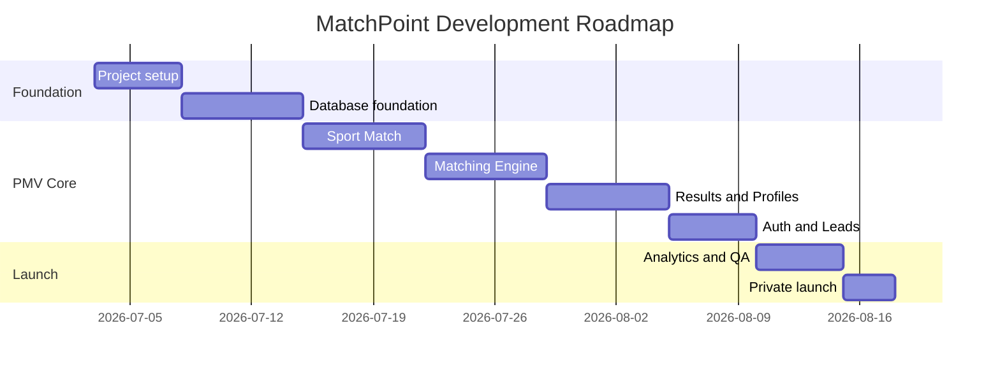

# Roadmap — MatchPoint

Living document (Fase 4 · Desarrollo, added 2026-07-03). Recommended development sequence — implement in this order unless explicitly instructed otherwise. Detailed, milestone-level companion to `docs/product-brief.md` §21's product-level roadmap (PMV/V1.1/V2/V3) — this doc supersedes that section for sequencing detail; `product-brief.md` still owns the product-level framing.

The goal is to validate the PMV before building advanced features. Each milestone should create a usable product increment — the PMV does not need to be a complete marketplace, it needs to prove that users can complete Sport Match™, receive recommendations, open profiles, contact organizations, and generate measurable leads.

## Milestone 0 — Project foundation

Goal: prepare the project for development with clear standards, structure, and environment.

Scope: repository setup, environment variables, PWA base, design tokens, routing, Supabase setup, auth provider configuration, basic deployment pipeline.

Deliverables: app shell, basic layout, mobile-first responsive base, Supabase connection, initial routes, basic error handling.

Done when: project runs locally; app deploys successfully; root page loads; environment variables are documented.

## Milestone 1 — Data foundation

Goal: create the database and seed enough data to support Sport Match™.

Scope: sports, districts, organizations, organization_sports, venues, schedules, ADN Deportivo™, match_sessions, match_results, leads (per `docs/database-schema.md`).

Deliverables: database migrations, seed data, public organization query, minimum sample organizations.

Done when: at least 10 sample organizations exist; organizations can be queried by sport/district; data supports matching logic; suspended organizations are hidden.

## Milestone 2 — Sport Match™

Goal: build the guided questionnaire.

Scope: welcome screen, Match™ intro, Sport Match™ question flow, progress indicator, input validation, anonymous session state, completion event.

Deliverables: `/`, `/match`, question components, state management, analytics events.

Done when: user can complete all questions without login; flow takes under 60 seconds; answers are stored client-side and sent to backend; `sport_match_completed` event is tracked.

## Milestone 3 — Matching engine

Goal: generate ranked recommendations.

Scope: create match session, rule-based scoring, match labels, reasons, store match results, no-results state.

Deliverables: matching service, scoring functions, explanation generator, `/match/results`.

Done when: system returns up to 5 results; results include reasons; results exclude invalid organizations; results are stored in the DB; results screen displays correctly.

## Milestone 4 — Community profiles

Goal: allow users to evaluate a recommended community.

Scope: organization profile page, hero section, match context, schedule, location, description, ADN Deportivo™, contact CTA.

Deliverables: `/organizations/[slug]`, profile components, schedule cards, contact section.

Done when: user can open a profile from results; profile shows key information; contact CTA is visible; missing data has a graceful fallback.

## Milestone 5 — Auth and contact

Goal: create the North Star event.

Scope: auth gate, Google login, Apple login, Lead creation (immutable — see `docs/data-model.md`'s divergence note), external redirect, contact analytics.

Deliverables: auth gate screen/modal, Lead creation API, contact redirect handler, analytics events.

Done when: login appears only after contact click; a Lead is created before redirect; WhatsApp/Instagram/booking opens; the `lead_created` event is tracked.

## Milestone 6 — Analytics and PMV dashboard

Goal: measure the funnel.

Scope: core analytics events, event storage/integration, basic dashboard or SQL queries, weekly metrics.

Deliverables: analytics implementation, funnel tracking, SQL queries or dashboard.

Done when: funnel events are visible; contacts can be counted weekly; drop-off points can be analyzed.

## Milestone 7 — Launch prep

Goal: prepare MatchPoint for private validation.

Scope: data quality review, mobile QA, copy QA, error states, performance, initial organizations, manual test cases.

Deliverables: QA checklist, seeded organization list, launch checklist, bug fixes.

Done when: end-to-end flow works on mobile; at least 30-50 organizations are ready; no critical bugs in the core flow; PMV can be shared with testers.

## PMV launch

Goal: validate the product with real users.

Recommended launch audience: amateur runners, running teams, triathlon communities, training centers, friends in sports communities, early adopters in Lima.

Validation targets: 60%+ Sport Match™ completion rate; 25%+ result-to-profile CTR; 10%+ profile-to-contact CTR; 100+ contacts during the validation period; at least 30 organizations receiving contacts.

## V1.1 — Organization trust layer

Goal: improve supply-side quality.

Scope: profile claim flow, admin approval, claimed profile badge, verified profile badge, basic organization editing.

## V1.2 — Better discovery

Goal: improve user exploration after PMV.

Scope: map view, events calendar, saved matches, more filters, nearby districts. Features: "weekend activities", "what can I do today?", event pages, explore by district.

## V2 — Marketplace layer

Goal: create monetization and deeper organization value.

Scope: organization dashboard, lead analytics, featured profiles, event promotion, premium profiles, booking management (this is where the deferred `Booking` state machine from `docs/data-model.md` gets built).

Potential monetization: premium organization profiles, featured placement, paid event promotion, lead-based monetization, booking commission.

## V3 — AI sports advisor

Goal: make Match™ more intelligent.

Scope: natural language matching (see `docs/matching-engine.md`'s "Future AI layer"), personalized notifications, user sports profile, repeat recommendations, post-contact learning loop.

## Backlog parking lot

Do not build until PMV validates: native app, payments, chat, social feed, reviews, public user profiles, wearable integrations, full coach marketplace, training plan marketplace, brand sponsorship manager, advanced AI recommendations.

## Development sequence summary

## Final roadmap rule

Do not expand the product until the core PMV funnel works. The first version is successful when a user can go from uncertainty to contact in under five minutes.
