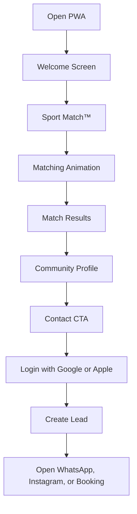
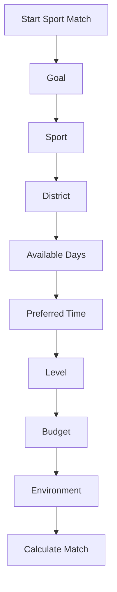
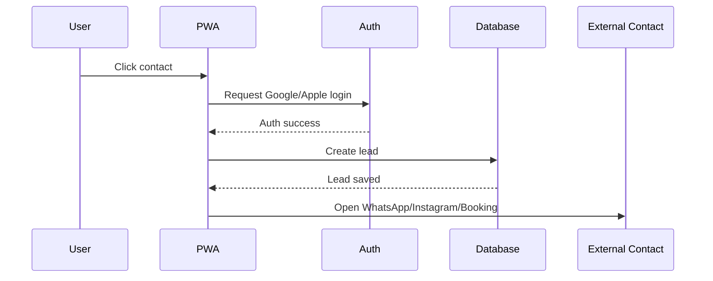
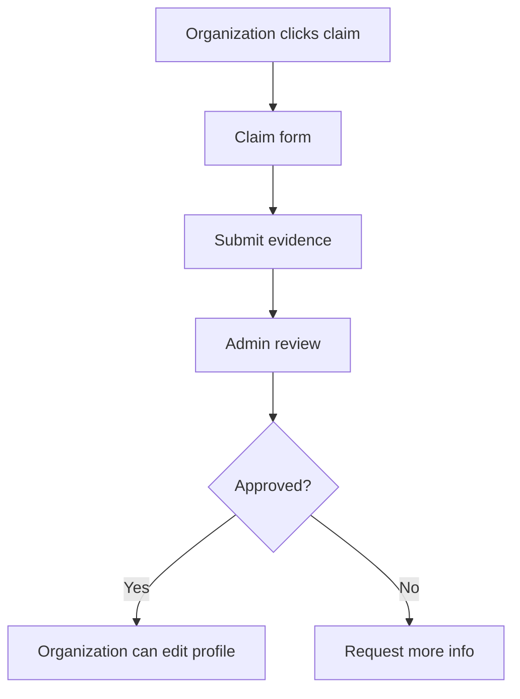

# UX Flows — MatchPoint

Living document. Defines the main PMV user flows. Use this document to implement navigation, screen logic, states, and flow constraints. The PMV has four core capabilities: Sport Match™, Results, Community profile, Contact. Do not add extra screens unless they support these flows.

## PMV flow overview

## Flow 0: Open app

Goal: let the user enter the experience with no friction. Screens: Splash → Welcome.

Rules: splash lasts under 2 seconds; no login, no menu, no onboarding carousel, no permissions request, no email capture. Success: user reaches welcome screen and can start Sport Match™.

## Screen 1: Welcome

Headline: "Hola, soy Match™." Body: "Te ayudo a encontrar una comunidad deportiva que encaje contigo. Tomará menos de un minuto." Primary CTA: "Comenzar Sport Match™."

Rules: only one primary CTA, no secondary CTAs in PMV, Match™ appears as the guide, tone is clear/warm/motivating.

## Flow 1: Sport Match™

Goal: collect minimum user preferences to generate recommendations. One question per screen; each screen has a progress indicator, Match™ microcopy, the question, answer options, and a continue button when required.

### Screens (question, options, validation)

- **Goal** — "¿Qué quieres lograr?" → Empezar un deporte / Preparar una carrera / Mejorar rendimiento / Mantenerme activo / Bajar de peso / Conocer gente / Otro. One option required; if "Otro", allow optional short text or defer to later version.
- **Sport** — "¿Qué deporte te interesa?" → Running / Trail / Ciclismo / Natación / Triatlón / Centro de entrenamiento. One option required in PMV; multi-sport selection later.
- **District** — "¿Dónde te gustaría entrenar?" → searchable district selector, Lima Metropolitana and Callao only. One district required. Edge case: if not available, show "Otro distrito" and capture text.
- **Days** — "¿Qué días puedes entrenar?" → Mon-Sun, multi-select. At least one day required.
- **Time** — "¿En qué horario prefieres entrenar?" → Mañana / Tarde / Noche. PMV can start with one required option.
- **Level** — "¿Cuál es tu nivel?" → Nunca practiqué / Principiante / Intermedio / Avanzado. One option required.
- **Budget** — "¿Cuánto quieres invertir al mes?" → Gratis / Hasta S/100 / S/100-S/200 / S/200-S/300 / Más de S/300 / No estoy seguro. One option required; "No estoy seguro" should not block matching.
- **Environment** — "¿Qué ambiente buscas?" → Competitivo / Social / Recreativo / Familiar / Alto rendimiento / Inclusivo. One option required in PMV; multi-select later.

## Flow 2: Matching animation

Purpose: create anticipation and make the experience feel personalized. Copy: "Estoy buscando comunidades que realmente encajen contigo..." Animated symbols: sport, location, calendar, people, sparkle. Duration ~3 seconds, never exceed 5. Even if computation is instant, show a brief transition for perceived personalization — no generic spinner only.

## Flow 3: Results

Headline: "Tu Match está listo." Subheadline: "Estas son las comunidades que más se parecen a lo que buscas."

Each result card: organization name, sport, district, match label, 3 reasons, main image/logo, primary CTA "Ver comunidad".

Rules: show up to 5 results; do not show raw percentages as primary UI, use "Excellent Match" / "Very Good Match" / "Good Match" labels; every result must include reasons; if fewer than 3 results exist, show closest matches and explain. A persistent "Cambiar mis respuestas" secondary action is always visible below the results list, regardless of match quality (`006-no-empty-results` FR-008) — resets and returns to Sport Match™'s first question.

### No-results flow

Trigger (narrowed, `006-no-empty-results`): zero organizations in the catalog offer the requested sport at all — not "weak matches exist," which is no longer a no-results case (those are always shown, honestly labeled). Copy: "Todavía no tenemos comunidades de este deporte." Action: "Elegir otro deporte" only — returns to the sport question specifically (not a full restart), keeping other already-answered context. Expand-district/change-schedule/notify-me are removed: none of those help when the gap is sport coverage, not answer shape. Never show an empty dead-end screen — always provide a next action.

## Flow 4: Community profile

Goal: help the user decide whether to contact.

Sections: hero image/logo, name, match label, why this is a match, description, schedule, location, level, environment, coach, price, services, photos, contact CTA.

Primary CTA: "Contactar". Secondary CTAs: WhatsApp, Instagram, "Reservar clase" — PMV can show a single "Contactar" button that opens contact options.

### Profile rules

- Contact CTA must be visible above the fold or sticky at bottom.
- If WhatsApp is missing, do not show WhatsApp. Same for Instagram and booking link.
- If price is unknown, show "Precio no confirmado". If schedule is unknown, show "Horario por confirmar".

## Flow 5: Contact

Goal: generate the North Star event. Trigger: user clicks WhatsApp / Instagram / "Reservar clase" / "Contactar".

If not logged in, show login screen. Headline: "Continúa para contactar." Body: "Así podremos guardar tu Match y ayudarte a medir si encontraste una comunidad para entrenar." Options: Continue with Google, Continue with Apple. No password, no email form, no full registration, no unnecessary fields.

### Lead creation flow

Lead fields: user ID, organization ID, match session ID, contact type, source, timestamp, sport, goal, district, result rank.

> **Note**: in this PMV model, "Contact" only creates a `Lead` record and redirects to an external channel (WhatsApp/Instagram/booking link) — MatchPoint does not manage booking/attendance state in-platform. Cross-reference the reconciliation note in `docs/data-model.md` before implementing, since it differs from that doc's existing `Booking` state machine.

## Flow 6: Returning user

User has previously completed Sport Match™. Options: continue with previous Match, or start new Sport Match™. PMV may simplify by always starting at welcome and offering "Start new Match". Future: saved matches, user profile, past contacts, new recommendations.

## Flow 7: Post-contact follow-up (future version)

24 hours after contact: "Hola, soy Match™. ¿Pudiste encontrar una comunidad para entrenar?" (Sí / Todavía no). If yes: "¡Qué buena noticia! Me alegra que hayas encontrado una comunidad." If no: "No hay problema. Probemos con nuevas opciones." PMV can log this manually or defer.

## Flow 8: Organization claim profile (V1.1, not PMV)

Entry: organization clicks "Reclamar perfil" on its profile.

Claim form fields: name, email, phone, role, organization, Instagram or website proof, optional document/evidence.

## Flow 9: Admin preload profile (PMV internal flow)

Goal: allow the MatchPoint team to preload organizations. Required fields: name, sport, district, contact, schedule, level, environment, description. Recommended fields: photos, coach, price, services, trial class.

## Navigation rules

Allowed PMV routes: `/`, `/match`, `/match/results`, `/organizations/[id]`, `/login`, `/contact/success`. Optional future routes: `/admin`, `/claim`, `/profile`, `/events`.

## Error states

- Auth error — "No pudimos iniciar sesión. Inténtalo otra vez."
- Contact missing — "Esta comunidad todavía no tiene un canal de contacto confirmado."
- Match error — "No pude calcular tu Match en este momento. Inténtalo nuevamente."
- Network error — "Parece que no hay conexión. Revisa internet e intenta de nuevo."
- Organization unavailable — "Esta comunidad ya no está disponible o está pendiente de verificación."

## Accessibility rules

Buttons must be large enough for mobile touch. Color cannot be the only way to communicate match quality. Text should be readable on mobile. Progress should be visible. Avoid tiny form fields. Use clear labels.

## Mobile-first rules

MatchPoint PMV is a PWA — design mobile first. Requirements: thumb-friendly CTAs, sticky contact button on profile, one question per screen, fast loading, minimal typing, clear progress, works well on iPhone and Android browsers.

## Analytics events

`app_opened`, `welcome_viewed`, `sport_match_started`, `sport_match_question_answered`, `sport_match_completed`, `results_viewed`, `result_card_clicked`, `organization_profile_viewed`, `contact_clicked`, `login_started`, `login_completed`, `lead_created`, `external_contact_opened`.

## Definition of PMV UX done

- A new user can open the PWA and start without login.
- Sport Match™ can be completed in under 60 seconds.
- The system shows up to 5 ranked results, each with an explanation.
- User can open a profile and contact after Google or Apple login.
- A lead is created before external contact opens.
- The entire flow can happen in under five minutes.

## Final UX principle

The user should never feel like they are navigating a directory. The user should feel like Match™ is helping them take the next step in their sports life.
