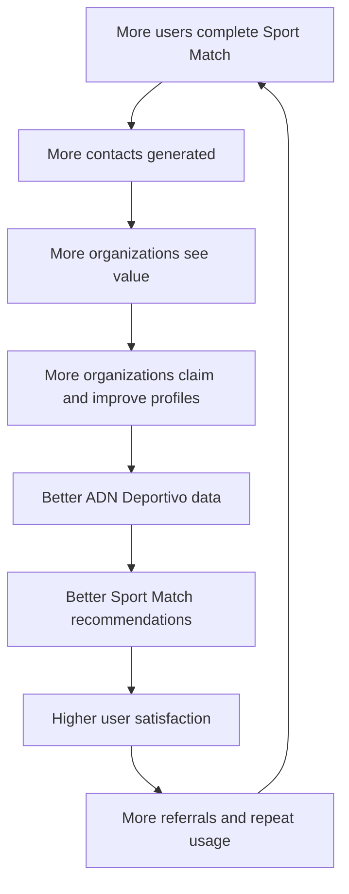

# Vision — MatchPoint

Living document. Highest-level source of truth for product direction — read before `docs/product-brief.md`. When making product, UX, or technical decisions, prioritize: (1) improving match quality between users and sports communities, (2) reducing friction before the user receives value, (3) making the experience feel like a personal sports advisor, not a generic directory, (4) optimizing for the North Star Metric below.

## Mission

Make finding the ideal sports community as easy as ordering a taxi or reserving a restaurant.

MatchPoint does not simply help people search for gyms, clubs, or teams. MatchPoint helps each person discover the sports community where they are most likely to belong, train, improve, and stay consistent.

## Vision

Become the platform where anyone in Peru can discover where to train, who to train with, and what sports activities are happening near them.

In ten years, when someone in Peru wants to start a sport, change communities, prepare for a race, find a coach, join a team, or discover a new sports experience, they should think of MatchPoint first. The long-term ambition is for MatchPoint to become the digital infrastructure of amateur sports in Peru.

## Ten-year statement

> "Todas las comunidades deportivas del Perú están aquí."

This is the emotional and strategic north of the company. MatchPoint starts in Lima Metropolitana and Callao with running, trail, cycling, swimming, triathlon, and training centers. Over time, it can expand to all sports, all regions, federations, professional events, official competitions, coaches, gyms, wellness services, and sports brands.

## What we are

MatchPoint is a sports discovery and matching platform. It connects:

- People with sports communities.
- Amateur athletes with teams.
- Beginners with safe entry points.
- Coaches with potential students.
- Training centers with people looking for structured programs.
- Event organizers with participants.
- Sports organizations with qualified leads.

MatchPoint is not a static directory. It is a decision engine that helps users answer: "Where should I train, with whom, and why is this the right fit for me?"

## What we are not

MatchPoint is not a social network, a generic directory, a gym marketplace, a payment-first marketplace, a content feed, or a copy of Instagram, Strava, Google Maps, or TikTok.

MatchPoint may eventually include social, marketplace, event, payment, and map features, but those features do not define the product. The identity of MatchPoint is matching.

## North Star Metric

> Contacts generated between users and sports organizations.

A contact is created when a user performs a direct intent action toward an organization, coach, event, or community.

Valid contact actions: click on WhatsApp, click on Instagram, click on "Reservar clase", submit contact form, click to call, request trial class.

Not counted: viewing a profile, seeing photos, saving a favorite, reading event details, browsing a list, completing Sport Match™ without contacting.

This metric represents value for both sides of the marketplace: the user found a relevant option, the organization received a potential customer or member, and MatchPoint proved it can create real-world connections.

## Core product promise

A user should be able to discover a relevant sports community and initiate contact in under five minutes. This promise must guide all product decisions. If a new feature increases the time to reach a contact without significantly improving match quality, it should not enter the PMV.

## Main product assets

### 1. Sport Match™

The guided matching experience that helps users discover the best sports community for them. It begins with the user's goal, not the sport — "What do you want to achieve?" instead of "What sport are you looking for?".

### 2. Match™

The digital guide that accompanies the user through the experience. Match™ is not a chatbot in V1 — it's a lightweight product character: clear, motivating, practical, and personal. Its role is to make the user feel understood, guided, and closer to finding the right community. See `docs/match-character.md` for the full voice/personality guide and `docs/microcopy.md` for the actual copy.

### 3. ADN Deportivo™

The structured profile that describes the personality and fit of each sports organization: community atmosphere, competitiveness, social energy, beginner friendliness, training intensity, coach style, level distribution, event frequency, services, culture. ADN Deportivo™ makes MatchPoint harder to copy because it creates a proprietary way of understanding sports communities. See `docs/matching-engine.md` for the full attribute schema.

## Product philosophy

People do not start by looking for a sport. They start by wanting a change: run their first 10K, prepare for a marathon, lose weight, make friends, stay active, improve performance, join a community, feel part of something, restart after a long time, find a healthier routine.

The sport is the means. The goal is the reason. MatchPoint must always design around the user's goal.

## Product obsession

The obsession is not growth, downloads, registrations, or content volume. The obsession is the quality of the match. Every product decision must ask: "Does this improve the probability that the user contacts and stays with a community that truly fits them?"

## Product principles (summary)

See `docs/product-principles.md` for the full 30-principle list. Headline principles:

1. The user always receives value before login.
2. The product starts with Sport Match™, not with search.
3. The community is more important than the venue.
4. Every screen must bring the user closer to a contact.
5. MatchPoint recommends; it does not force the user to search manually.

## Strategic differentiation

Google Maps can show places. Instagram can show posts. TikTok can show videos. Strava can show activity. MatchPoint understands context — what the user wants, where they are, when they can train, what level they have, what kind of environment they are looking for, and which communities best fit those needs.

The differentiation is not information. The differentiation is fit.

## Product flywheel

## PMV strategy

The PMV must validate:

1. Users prefer a guided recommendation over manual search.
2. Users are willing to answer a short questionnaire if it improves the recommendation.
3. Match explanations increase trust.
4. Organizations value contacts generated by the platform.
5. Contact can happen in under five minutes.

The PMV will be built as a PWA, using a Wizard of Oz approach for Sport Match™: the user experiences a smart recommendation flow, while the first version can use rules, manually curated data, and lightweight AI-generated explanations.

## Long-term vision

Today MatchPoint connects people with sports communities. Tomorrow MatchPoint can connect people with their full sports life: teams, training plans, events, coaches, competitions, nutrition, physiotherapy, equipment, recovery, wellness, official federations, professional sports experiences.

MatchPoint starts with discovery. It can become the sports operating system for amateur athletes in Peru.

## Final statement

MatchPoint does not help people find places. MatchPoint helps people find where they belong.
