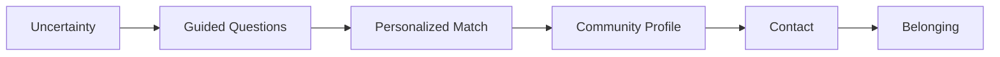

# Visual Direction — MatchPoint

Living document (Fase 3 · Diseño, added 2026-07-03; grounded in the real logo 2026-07-04). Design inspiration reference for anyone implementing UI — pairs with `docs/design-system.md` (concrete tokens/rules) and `docs/component-library.md` (components).

The abstract direction below is now backed by a concrete, named style — **Iridescent Glass** (see `docs/design-system.md`'s "Named style" section) — with hex values pixel-extracted from `logo.png` (repo root). Read this doc for the *why*, `design-system.md` for the *exact values*.

**Inspiration boundary**: MatchPoint takes inspiration from Luma's clean, curated, event-like experience quality — but must not copy Luma's proprietary layouts, colors, icons, branding, copy, illustrations, or visual identity. Use Luma as a quality benchmark, not a template (see "Anti-copy rule" below).

## Design inspiration

MatchPoint is inspired by the experience quality of products like Luma: curated discovery, beautiful event-style pages, strong use of cover imagery, simple registration/contact flows, premium but accessible interface, clean cards, strong whitespace, minimal friction, mobile-first layouts, human microcopy.

However, MatchPoint is not an events product — it's a sports community discovery and matching product. The visual direction must feel more active, energetic, physical, goal-oriented, connected to training and movement, and focused on belonging.

## Design positioning

**Not this**: generic gym app, aggressive dark fitness app, neon-heavy performance dashboard, social feed, complex marketplace, sterile corporate SaaS.

**Yes this**: premium sports discovery, curated community pages, clean onboarding, beautiful cards, human guidance, calm energy, editorial but sporty, mobile-first, trustworthy and warm.

## Design keywords

Curated, clean, premium, energetic, human, sporty, warm, trustworthy, fast, modern, community-centered.

## Visual translation from Luma inspiration

| Luma-like pattern | MatchPoint translation |
|---|---|
| Event page | Community profile |
| RSVP/Register CTA | Contact / Reserve trial class |
| Event cover image | Community hero image |
| Host profile | Organization / coach profile |
| Event discovery | Sport community discovery |
| Event tags | Sport, level, environment tags |
| Attendee/social proof | Community atmosphere / ADN Deportivo™ |
| Event theme | Community personality |

## Core visual metaphor

MatchPoint is not a map. MatchPoint is not a feed. MatchPoint is a guided path to belonging.

## Visual system direction

**Layout**: mobile-first, generous whitespace, rounded containers, large touch targets, minimal top navigation, sticky bottom CTAs where useful, one primary action per screen.

**Imagery**: real, candid, community-based, outdoors when relevant, active but not intimidating, inclusive, Lima/Peru-contextual when possible. Avoid overly staged stock fitness photos, extreme bodybuilding visuals, generic gym equipment closeups, dark aggressive fitness clichés.

**Cards**: central to the experience — should feel like curated recommendations, not database rows. Include a strong title, image or visual marker, match label, 2-3 reasons, clear CTA, tags. The top result and hero moments use the Iridescent Glass treatment (`docs/design-system.md`); the rest of the list stays flat for legibility.

**Motion**: subtle. Recommended uses: Sport Match™ progress, match calculation transition, button feedback, card entrance, contact confirmation. Avoid distracting animations, excessive loading, gamification-heavy motion.

## Tone of interface

The interface should feel like Match™ is guiding the user (see `docs/match-character.md`).

Good: "Encontré comunidades que encajan contigo.", "Este match funciona porque…", "Puedes contactar cuando estés lista.", "Probemos con opciones cercanas."

Avoid: "Search results.", "Listings.", "Vendors.", "Submit query.", "No data available."

## Page-level direction

- **Welcome** — personal and direct; make the user feel guided in under five seconds.
- **Sport Match™** — a premium guided experience, not a form; one question per screen.
- **Results** — curated, not "many results" but "your best matches".
- **Community profile** — a beautiful event/community page; this is where Luma inspiration is strongest, adapted to sports.
- **Contact** — a natural next step, not a conversion trap.

## Trust direction

Because MatchPoint connects people to real-world communities, trust must be visible: claimed profile, verified organization, verified coach, last updated, real photos, clear schedule, clear location, clear contact method, trial class availability.

## Accessibility direction

High contrast text; buttons at least 44px high; avoid tiny pills as primary controls; use labels, not only icons; ensure keyboard and screen reader compatibility; avoid communicating match quality only with color.

## Anti-copy rule

Do not reproduce Luma's exact layouts, spacing, colors, type treatments, icons, components, animations, copy, or brand assets. Use Luma as a quality benchmark, not a template.

## Final visual direction

MatchPoint should feel like a beautiful, curated sports discovery app where a digital guide helps you find the community where you belong — combining the elegance of an event platform with the energy of amateur sport and the trust of a personal recommendation.
